# **Detailed Instructions: Deploying a Static Website on AWS S3**
In this guide, we'll explore Amazon Web Services (AWS) through a hands-on example of hosting a static website on Amazon Simple Storage Service (S3). Although there are numerous cloud providers to choose from, this tutorial will focus on AWS. I'll walk you through a straightforward, step-by-step process to get your static website up and running on S3 seamlessly. By following these simple steps, you'll not only learn how to leverage AWS for hosting static content but also gain practical experience with one of the most widely used cloud platforms.

### **What Is AWS S3**
Amazon Simple Storage Service (Amazon S3) is a highly scalable and secure cloud storage solution offered by Amazon Web Services (AWS). Designed to handle massive volumes of data storage and retrieval, S3 serves as a pivotal foundation for building a wide range of cloud-based applications. It functions as a virtual storage space in the cloud, allowing you to store and access various types of files, such as photos, videos, documents, or any other data, from anywhere with an internet connection. S3 is known for its reliability, durability, and ease of use, making it a fundamental building block for numerous cloud-based services and applications.  

Some of the key features and concepts of Amazon S3 are as follows;
1. **Unlimited Scalability:** S3 can store and retrieve virtually unlimited amounts of data, automatically scaling up or down based on your needs. You don't have to worry about running out of storage space or managing infrastructure.
1. **High Durability and Availability:** Your data is redundantly stored across multiple facilities within a region, ensuring high durability and availability. S3 is designed to provide 99.999999999% (11 9's) of data durability, meaning your data is incredibly well-protected against hardware failures or disasters.
1. **Object-Based Storage:** Instead of using traditional file systems, S3 stores data as objects. Each object has a unique key (identifier), the data itself, and customizable metadata. This object-based structure makes it easy to organize and manage large amounts of data.
1. **Data Security and Access Control:** S3 provides robust security features, including fine-grained access control, encryption, and secure data transfer. You can control who can access your data and what actions they can perform on it, ensuring data privacy and compliance.
1. **Data Management and Lifecycle Policies:** With S3, you can easily categorize and manage your data using metadata and tags. You can also set lifecycle policies to automatically transition objects to different storage classes or delete them after a specified time, optimizing storage costs.
1. **Static Website Hosting:** S3 can be used to host static websites, allowing you to serve web content directly from the cloud. This makes it a cost-effective and simple solution for deploying websites and web applications.
1. **Data Replication and Versioning:** S3 supports cross-region replication, allowing you to replicate data across different AWS regions for improved availability and compliance. It also provides object versioning, enabling you to preserve, retrieve, and restore every version of every object stored in a bucket.

Leveraging the static website hosting capability of Amazon S3 buckets offers an opportunity to host static websites in a cost-effective manner while ensuring scalability to accommodate even millions of users. As a firm advocate of hands-on learning approach, I strongly believe that practicing what I have learned is a powerful way to solidify and reinforce my understanding. Implementing a practical example, such as hosting a static website on S3, allows me to apply the theoretical knowledge gained, thereby enhancing my grasp of the subject matter and deepening my comprehension of this principles. 

## **Steps To Host A Static Website on Amazon S3**
**Step 1: Sign In to AWS Console**
1. Launch your preferred web browser and access the [AWS Management Console](https://aws.amazon.com/)
2. Log into to your AWS account by providing your unique login credentials, consisting of your username and password.  
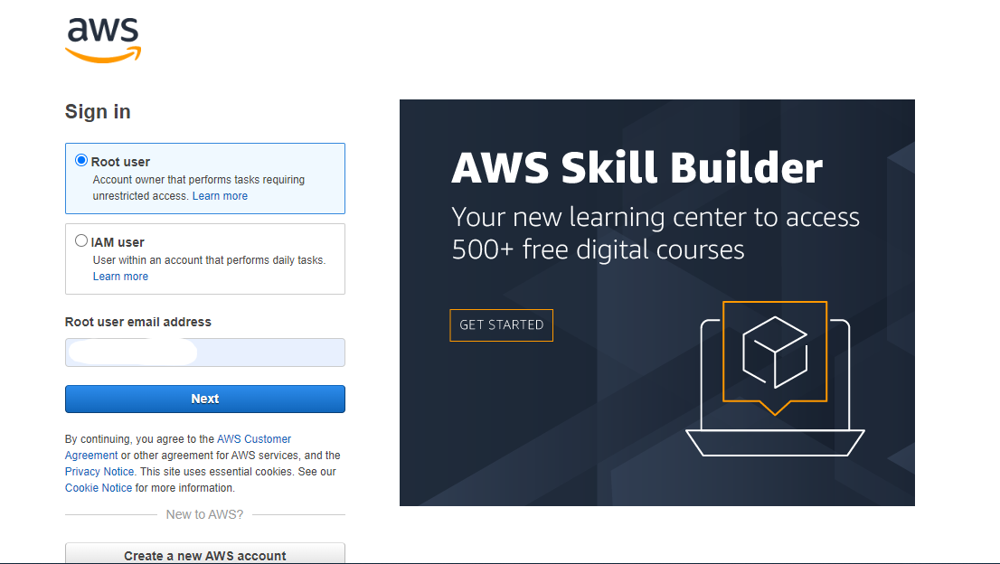

**Step 2: Create an S3 Bucket**
1. In the AWS Management Console, search for “S3” service. Once within the S3 service interface, initiate the bucket creation process by clicking the  "Create bucket" button.  
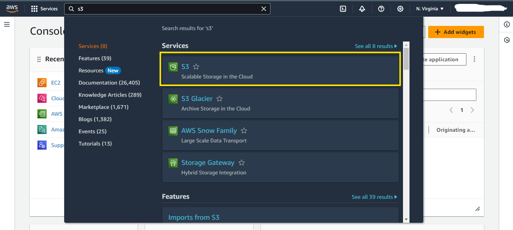
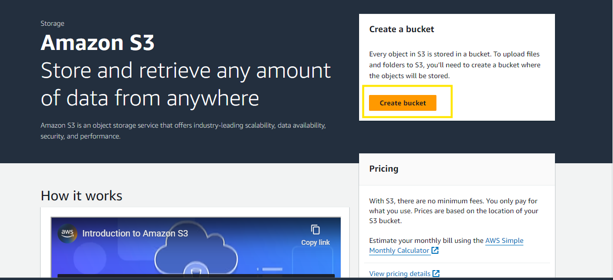
1. Assign a globally unique name to your new bucket, ensuring no other AWS user has claimed the same name. For example, you could name *"hosting-static-website-testing"* 
1. Select the AWS region that is geographically closest to your target audience, as this will optimize performance and minimize latency.  
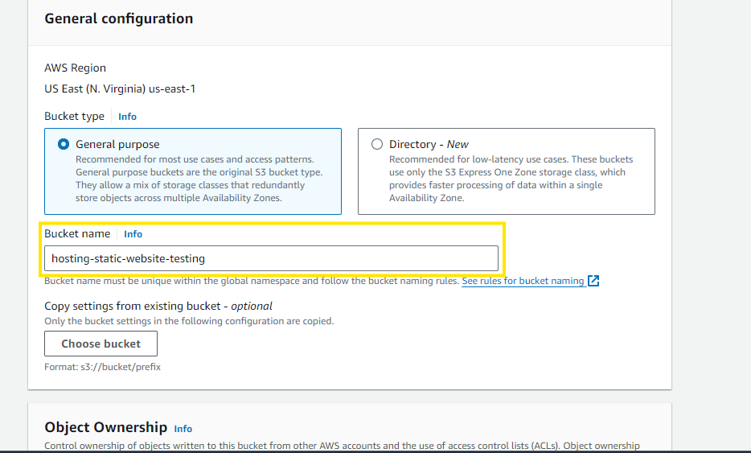
1. For the remaining configuration options, you can leave the default settings unchanged, as they should suffice for hosting a static website. Later in the guide, we will be looking into them.   
1. After reviewing your selections, proceed with the bucket creation by clicking the "Create bucket" button.  
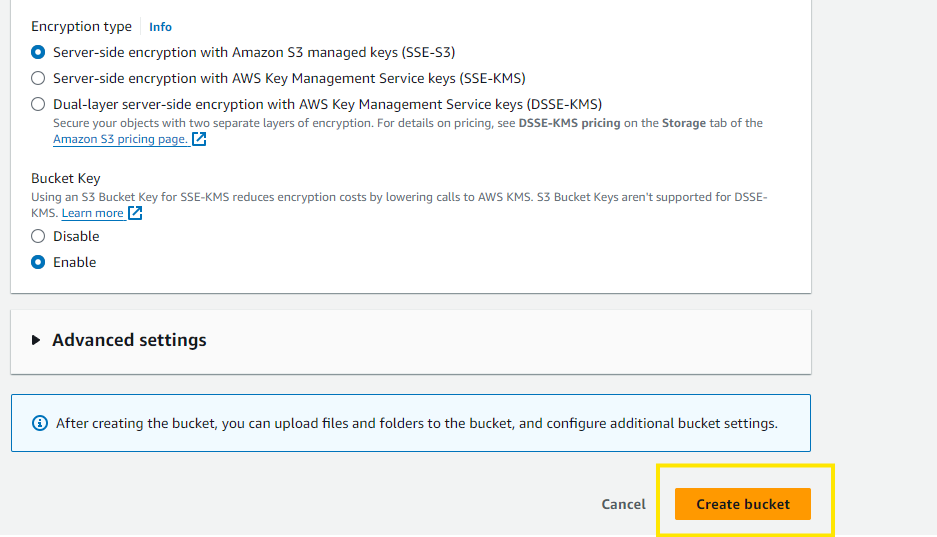
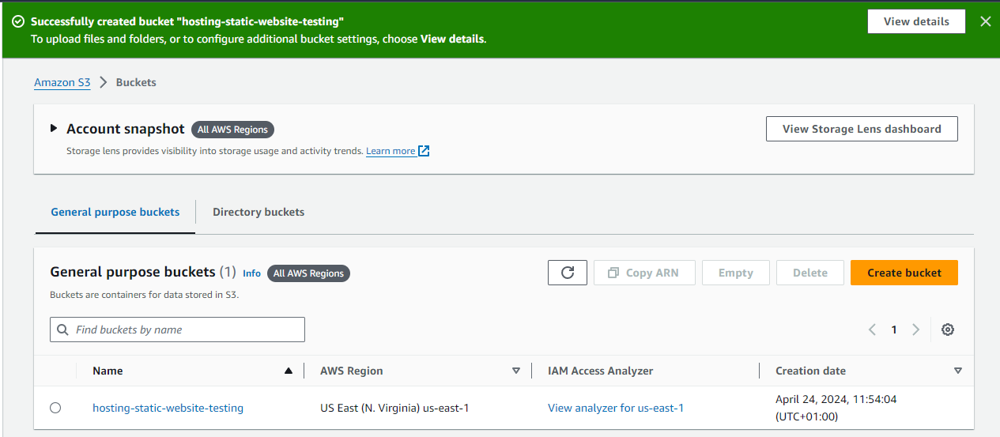

## **Bucket Configuration**
It is important to mention that you already have a folder on your local machine which contains all the files for the website you want to host.   
**Step 1: Upload Files**  
1. Upon the successful creation of your bucket, locate it in the S3 interface and click on it to access its configuration and management options.  
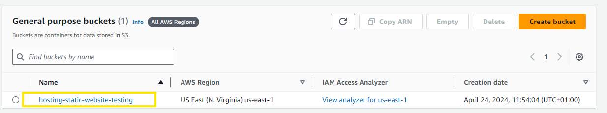
1. Within the bucket interface, locate and click on the "Upload" button, which will prompt you to add the necessary files and folders for your static website. Proceed by clicking **Add files** and selecting all the relevant files and directories that comprise your website's content..  
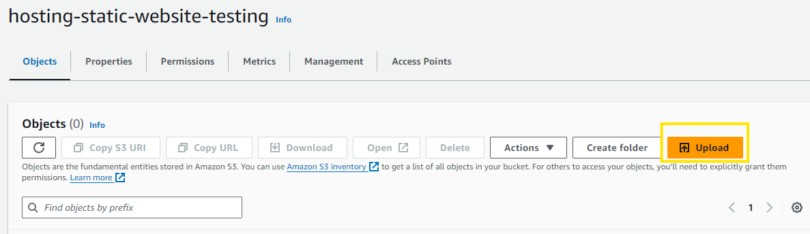 
1. Once you have selected all the required files and folders, initiate the upload process by clicking the **Upload button**. This action will securely transfer your website's files and structure to the designated S3 bucket, preparing the environment for hosting your static website.  
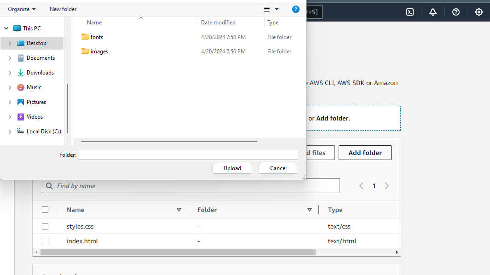
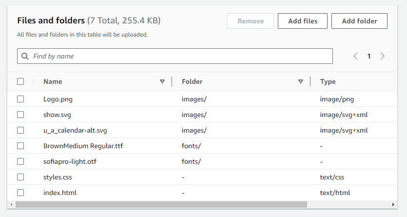
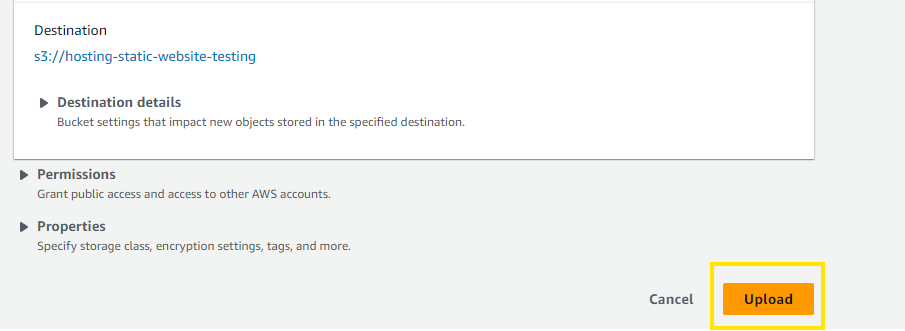
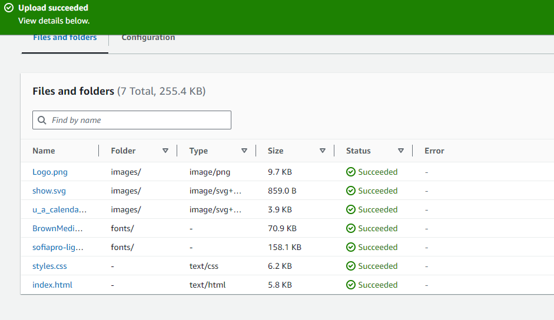

**Step 2: Configure Bucket Properties**  
Return to the interface of the S3 bucket you created earlier, and locate the **"Properties"** section. Scroll down until you find the "Static website hosting" option, and select it. Within the static website hosting configuration interface, click the **"Enable"** button to activate this feature. Assign the appropriate name to your index document, which typically would be **"index.html"**. You have the option to specify an error document as well, but it's not mandatory. Once you've reviewed the settings, click the **"Save changes"** button to apply the configuration.  
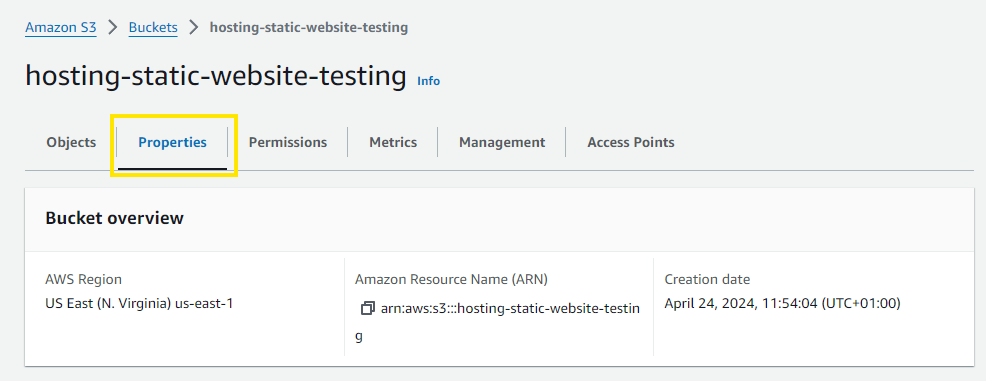
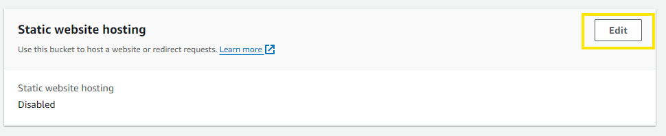
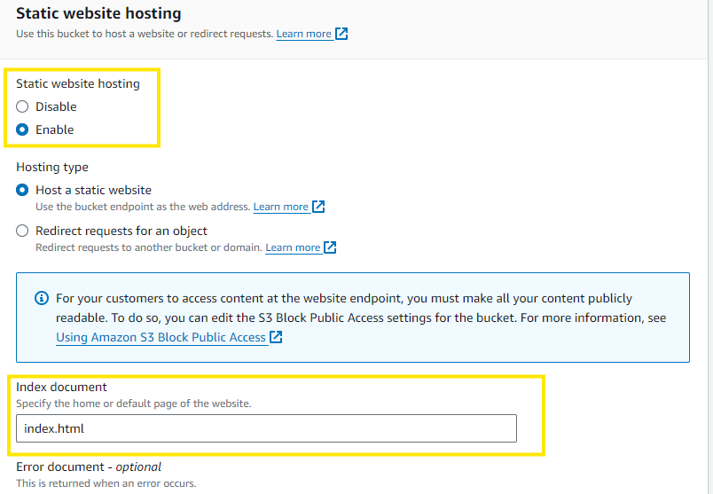
**Step 3: Configure bucket Permissions**
Step 3: Configure Bucket Permissions
1. While still within the bucket interface, click on the **"Permissions"** tab. You will notice a setting titled **"Block public access"**. Initially, this option might be enabled, restricting public access to your bucket's content. To allow public access, which is necessary for hosting a static website, you need to **unckeck the "Block public access" box**. After making this change, click the **"Save changes"** button to update the bucket's permissions accordingly.  
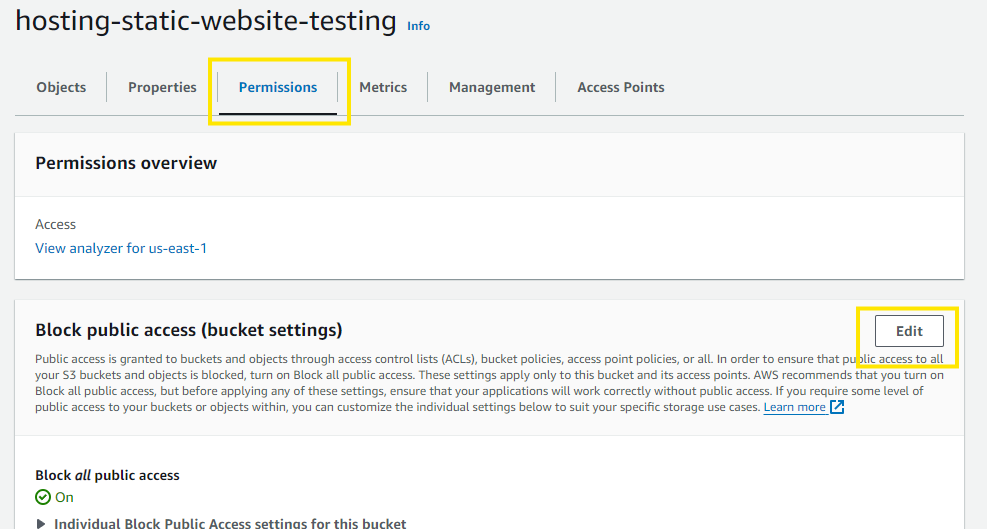
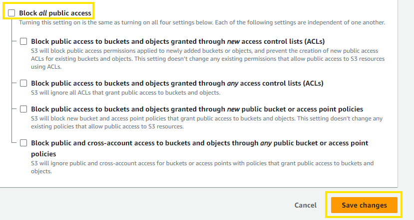  
1. Still within the "Permissions" interface, scroll down until you locate the **"Object Ownership"** section, and click on **"Edit"**. Here, you need to enable the **"Access Control Lists" (ACLs)** option. After acknowledging the changes you're making, click on **"Save changes"** to apply this configuration 
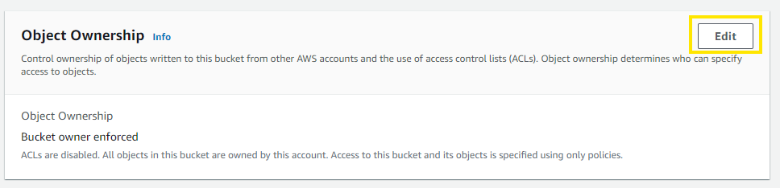
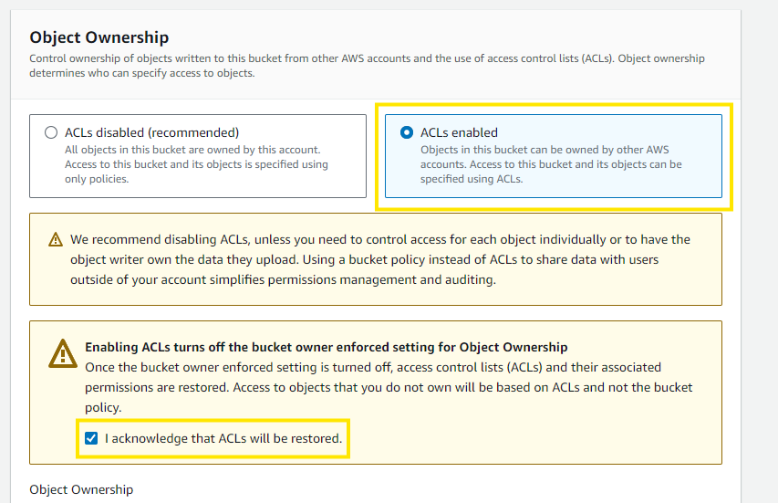

**Step 4: Configure Files and Folders**  
To ensure that all the files and folders you uploaded to the S3 bucket are publicly accessible, follow these steps:

1. Select all the objects (folders and files) within the bucket.
1. Click on the "Actions" button, and then choose the "Make public using ACLs" option.
1. Confirm the changes, and click "Save changes" to apply the public access configuration to all the selected objects.
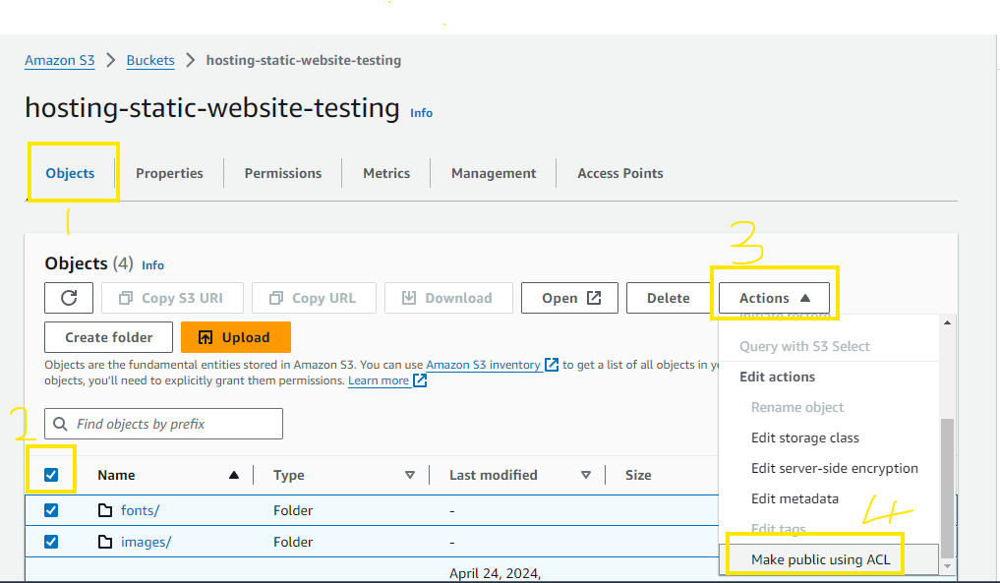
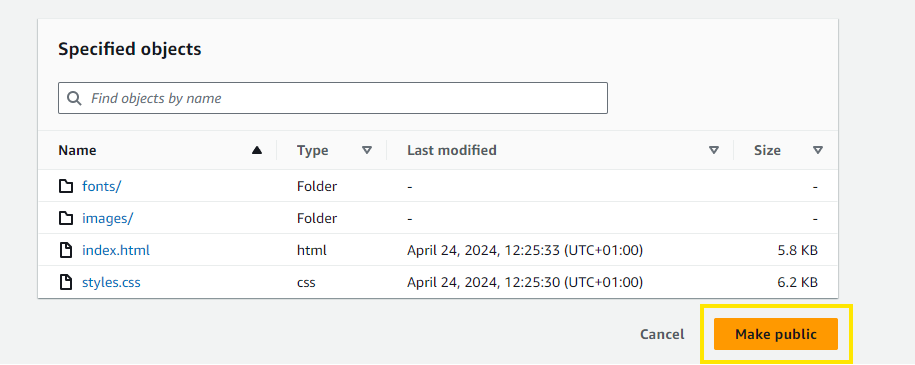  
Finally, to access and verify your hosted static website:

1. Locate and click on the "index.html" file within the bucket.
1. Copy the HTML link associated with this file.
1. Open a new tab or window in your web browser.
1. Paste the copied link into the address bar and press Enter. This should load your static website hosted on the S3 bucket.  
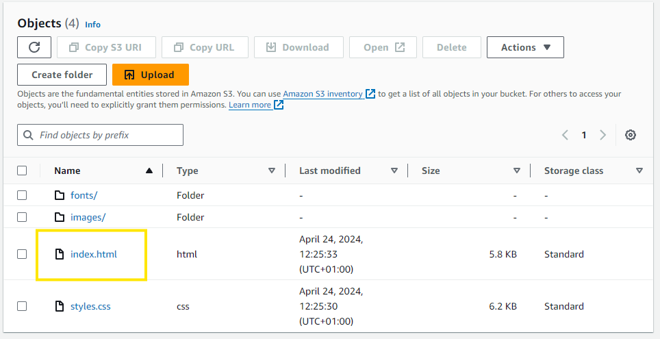
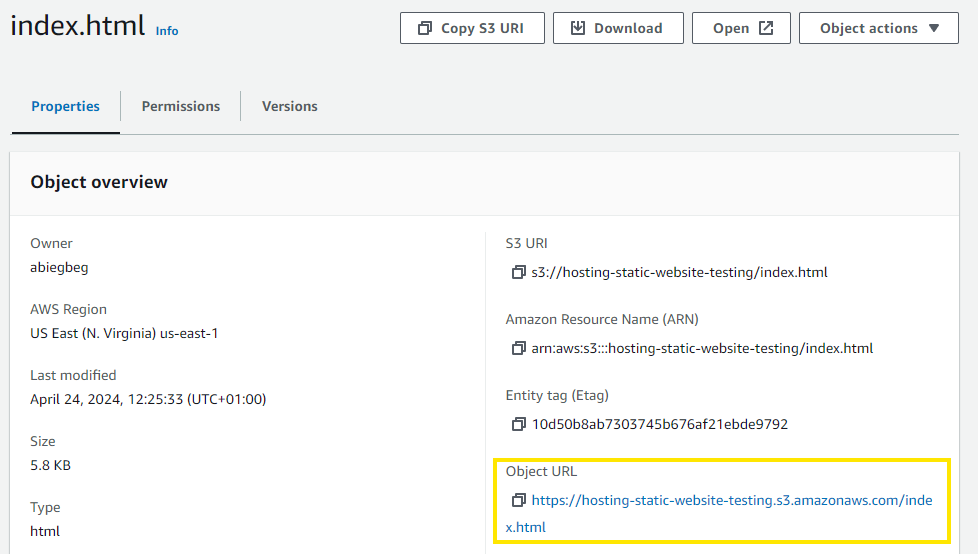
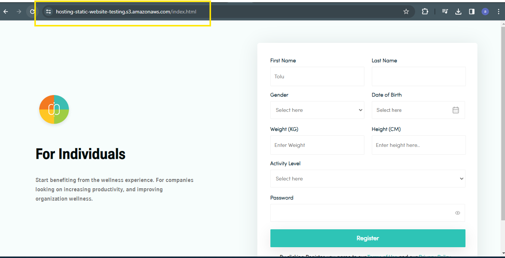
