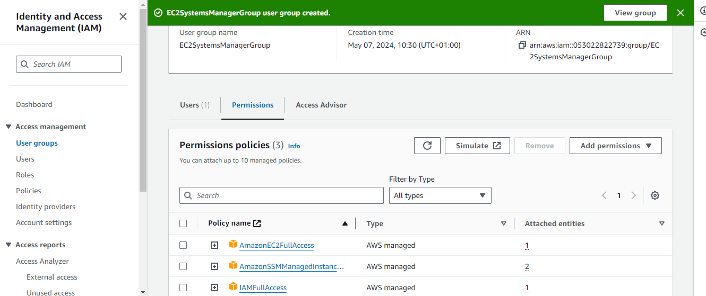

# Remotely Run Commands on an EC2 Instance with AWS Systems Manager

In this step-by-step guide, I'll be explaining how to use AWS Systems Manager to remotely run commands on your Amazon EC2 instances.

I'll do this by signing in to my AWS account with a user account I already made in IAM, not as the root user. I've chosen to use an IAM account because, for instance, if you're a sys admin, your organization's security team won't let you directly access production servers through SSH or use bastion hosts. Nevertheless, one of your job descriptions will be carrying out tasks like updating packages on your EC2 instances. So it is important to still carry out these tasks even with these limitations.

To solve this issue, we would create a user just in case you don't have an existing user. Then we will set up an Identity and Access Management (IAM) role while following best practices. Thereafter, we'll use the AWS-UpdateSSMAgent document to upgrade the Systems Manager Agent. Then, we'll use Systems Manager to send a command to various EC2 instances running.

## Assiging Permission to ther User
The first step is to log into the [AWS Management Console](https://console.aws.amazon.com). This gives us complete access to all privileges, so we can create users, user groups, and assign policies as needed.  

In the AWS Management Console, navigate to the IAM service by clicking on `Services` in the top left corner. Then, under the `Security, Identity, & Compliance` section, select "IAM. Another way to go about it is by simply typing **"IAM"** in the search bar and clicking on it from the results.

### **Step I: Creating A User and Usergroup**
1. While you're within the IAM console, click on `Users` in the left-hand navigation pane. Thereafter click on the `Create user` button.  
 

1. Enter a username for the new user, like "test-user." Then, select the type of access. For simplicity, I recommend choosing "Programmatic access," which will create an access key ID and secret access key.    
  

Click on the `Next` button.

1. After that, you'll see a tab to assign permissions to the user using `Add user to group`. The idea here is to gather all the permissions we want to give to the user into a single group. To do this, click on `Create group` to continue.
 
1. However, since I already created a user, I'll just be adding a new user group to this user. Click on `User groups` on the left navigation bar, then select `Create group`.

1. While you're in the user group settings, you can give the group a name like **"EC2SystemsManagerGroup"**. Then, select the user you want to attach this group to. 

1. Since the aim of this usergorup is to enable the user being created to carry out tasks like updating necessary packages, we need to assign specific permissions. These permissions include `IAMFullAccess`, which grants full access to IAM privileges, `AmazonEC2FullAccess` for full access to EC2 resources, and `AmazonSSMManagedInstanceCore`, which provides the necessary permissions for basic Systems Manager (SSM) functionality on EC2 instances. By assigning these permissions, the user will have the authority to perform the required actions seamlessly within the AWS environment.

## **Step 2: Login to the User and Create Roles**
1. Once you've finished creating the user and usergroup and assinging the neccessary permissions, log out of the account you signed into as root. Then, log back in as an `IAM user`. Navigate to the IAM console by searching for it in the search bar. Within the IAM console, select `Roles` from the left navigation menu, and then proceed to create a new role.
  

 1.  On the Select trusted entity page, under `AWS Service`, choose `EC2`, and then choose `Next`.
 
 
1. On the `Add permissions` page, type `AmazonEC2RoleforSSM` in the search bar. From the policy list that appears, select `AmazonEC2RoleforSSM,` and then click `Next` to proceed.
 
1.  On the "Name, review, and create" page, enter *EnablesEC2ToAccessSystemsManagerRole* in the `Role name` box. In the `Description` box, type *Enables an EC2 instance to access Systems Manager.* Finally, click on `Create role` to complete the process.

## **Step 3: Create an EC2 instance**
1. At this point we will be creating an EC2 instance using the "EnablesEC2ToAccessSystemsManagerRole" role. This role will enable the EC2 instance to be managed by Systems Manager. To do this, search for EC2 on the search bar and click on it. Then on the EC2 dashboard, select your preferred region, I choose us-east1 and click on `launch instance`.

  

1. In the box to assign a name to the instance, you can use "DemoSysAdmin," or any name you prefer. Then, select the operating system for the virtual machine, such as "Ubuntu," which is available for free tier accounts. Keep the default selection that appears in the dropdown menu.  

1. Choose the t2.micro instance type to assign adequate compute power to this virtual machine.

1. Since we are using Systems Manager to run commands remotely, we wo't be needing a keypair. Therefore scroll down to the key pair option and select *Proceed without a key pair* on the dropdown box. 

1. Keep the default settings under `Network settings` and `Configure storage`.

1. Under `Advanced details,` in the `IAM instance profile` dropdown, choose the "EnablesEC2ToAccessSystemsManagerRole" role we created earlier. Leave everything else as default, then click on `Launch instance`.  

## **Step 4:  Update the Systems Manager Agent**
Now that you have an EC2 instance running the Systems Manager agent, we can automate administrative tasks and manage the instance more efficiently. We will be running a pre-packaged command, known as a document, to upgrade the agent. It's considered a best practice to always update the Systems Manager Agent when you create a new instance, ensuring that we have the latest features and security patches.

